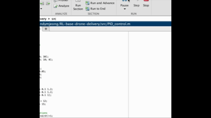
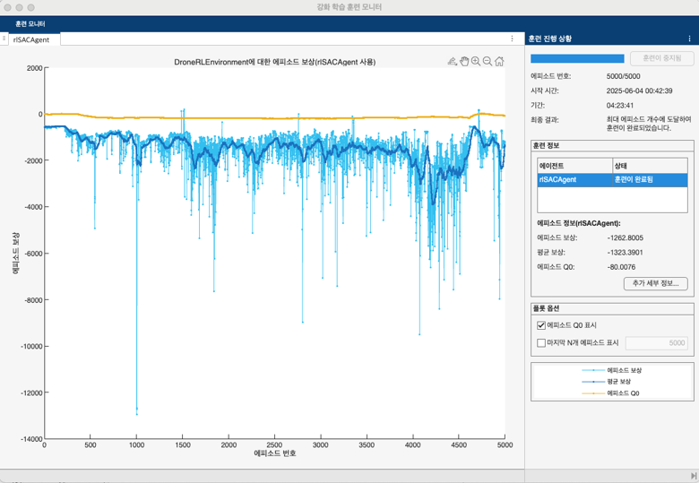
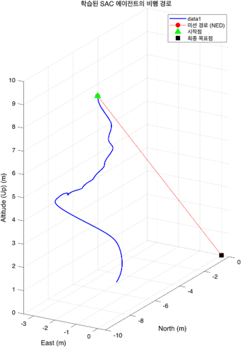

# RL-base-drone-delivery
New Drone Delivery System based on RL(Reinforment Learning).
We use MATLAB software for our project.
Our project's goal is that building and simulating new drone control system using RL and comparing with conventional PID control system.

# Team worker
- Sungcheol Ha(sungchol3@kaist.ac.kr)
- Hunwoo Jung(hyunu138@kaist.ac.kr)
- Donghak Lee(lidonghak1@kaist.ac.kr)

# Project Outline
- Build simulation environment
- PID control system
- RL control system

# Environment
Our drone object is moving in virtual environment built in MATLAB.
Our drone will start to move at (-10,0,10) and aim to arrive at (0,0,0). The simulation environment and objects are implemented using MATLAB's [UAV Toolbox](https://kr.mathworks.com/products/uav.html).

# Mission Profile
Our mission is delivering a given load in given environment with drone delivery system. Detailed informations are shown in below:

- Size of drone: 1.5m $\times$ 1.5m $\times$ 1.5m[^ref-drone]
- Weight of drone: about 30kg[^ref-drone]
- Size of payload: 50cm $\times$ 50cm $\times$ 50cm
- Weight of payload: 1kg
- Start point: $x = -10$ m, $y = 0$ m, $z = 10$ m
- End point: $x = y = z = 0$ m
- No any obstacles
- Same gravity with Earth ($9.8 \mathrm{m/s^2}$)

Our mission's goal is that making more *efficient*, *faster*, and *safer* drone delivery control system using **RL**(Reinforcement Learning).

We will compare the performance of each control systems for two parts: **traveling time** and **impulse just before landing**.

# PID control system
PID control system is implemented from mathematical principle of PID. You can easily check about the PID control's principle in [here](https://en.wikipedia.org/wiki/Proportional%E2%80%93integral%E2%80%93derivative_controller).

The simulation result of PID system is shown in [Fig. 1](#fig1).

**Fig 1. Result of Simulation of PID control system**

Performance's parameters are listed in below:

Time(s) | $I_{z} (\mathrm{N \cdot m})$
:---: | :---:
8.61 | 0.02

**Table 1. Performance of PID control system**

# RL control system
In this project, we use **SAC**(Soft Actor-Critic) model for RL model. Because it works for continuous environment and it studies very randomly, so it guarantees high-quality performance. We used [SAC agent](https://www.mathworks.com/help/reinforcement-learning/ug/soft-actor-critic-agents.html) built in MATLAB.

Please check detailed setting, parameters, or functions in code (`main_test_RL.m`, `SACTrainingManager.m`, `DroneRLEnvironment.m`, `calculate_reward.m`).

The training monitor of RL is shown in [Fig. 2](#fig2).

**Fig 2. Training monitor of SAC agent**

And the final trajectory of trained model is shown in [Fig. 3](#fig3).

**Fig 3. Result of Simulation of RL control system**

Performance of RL is presented in [Table. 2](#tab2).

Time(s) | $I_{z} (\mathrm{N \cdot m})$
:---: | :---:
5.4 | 1.5

**Table 2. Performance of RL control system**

# Conclusion
Performances(traveling time, impulse) of RL system are better than PID system, however drone in RL system does not arrive to target point (0,0,0). The new RL system shows promise, but requires further improvement. It can be improved for adjusting reward's parameters and more training.

# Notice
This work is a team project carried out as part of the course **[AE300] Flight Mechanics Project** at [KAIST](https://wwww.kaist.ac.kr) in 2025.

---

[^ref-drone]: The size and weight of drone are refered from the Amazon's delivery drone model: MK27-2